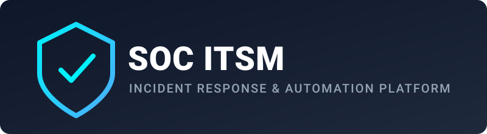

<p align="center">
  
</p>

<p align="center">
  <a href="LICENSE"></a>
  <a href="#"></a>
  <a href="#"></a>
  <a href="#"></a>
  <a href="#"></a>
  <a href="SECURITY.md"></a>
</p>

> [!IMPORTANT]
> **Production Hardening:** Always generate unique secret keys in `.env` before public deployment. Refer to [SECURITY.md](SECURITY.md) for vulnerability reporting guidelines.

---

## 🛡️ Overview

An enterprise-ready **SOC Incident Ticketing & Automation Platform**. Designed to streamline Security Operations Center workflows by bridging real-time SIEM alerts (Wazuh), automated orchestration (n8n), Web Application Firewall defense (SafeLine WAF), and role-based incident tracking (FastAPI + React).

---

## 🔥 Key Capabilities

- **Automated Incident Ingestion:** Receives real-time security alerts from Wazuh SIEM and webhook triggers via n8n pipelines.
- **Role-Based Access Control (RBAC):** Fine-grained permissions for L1 Analysts, L2/L3 Engineers, and SOC Managers mapped via LDAP / DB.
- **WAF Enforcement:** Fronted by SafeLine WAF / Nginx reverse proxy to filter malicious HTTP/HTTPS payloads.
- **Incident Response Ticketing:** Triage statuses, severity tagging, automated assignments, and escalation workflows.
- **Notification Pipelines:** Automated instant alerts dispatched directly to Telegram channels and security teams.

---

## 🏗️ How It Works

```text
  [ External Web Traffic ]
            │
            ▼
    ┌────────────────┐
    │ SafeLine WAF   │
    │ HTTP Filtering │
    │ Reverse Proxy  │
    └───────┬────────┘
            │
   ┌────────┴──────────────────────────┐
   │                                   │
   ▼                                   ▼
┌───────────────┐             ┌─────────────────┐
│ React Frontend│             │  FastAPI Core   │
└───────────────┘             └────────┬────────┘
                                       │
            ┌──────────────────────────┼──────────────────────────┐
            ▼                          ▼                          ▼
   ┌─────────────────┐        ┌─────────────────┐        ┌────────────────┐
   │ PostgreSQL DB   │        │   Redis Cache   │        │ LDAP / Auth    │
   └─────────────────┘        └─────────────────┘        └────────────────┘
            ▲
            │
   ┌────────┴────────┐
   │  n8n Workflows  │
   └────────┬────────┘
            ▲
            │
   ┌────────┴─────────────────────┐
   │ Wazuh / Telegram Webhooks    │
   └──────────────────────────────┘

See docs/ARCHITECTURE.md for detailed component breakdowns.

🛠️ Quickstart
1. Clone repository
git clone https://github.com/nizarsaidi-exe/SOC-ITSM-Platform.git
cd SOC-ITSM-Platform
2. Configure environment template
cp .env.example .env
3. Build and run container stack
docker compose up -d --build
📚 Technical Documentation
Document	Description
📐 Architecture Guide	Network design, container communication, and data flow.
🔌 API & Webhook Integrations	Endpoint specifications, n8n trigger hooks, and payloads.
🔐 RBAC & Permissions Matrix	User roles, LDAP integration, and access controls.
⚙️ Deployment & Setup Guide	Installation, volume persistence, and database backups.
🛡️ Security Policy	Vulnerability disclosure policy and security response.
🌐 Community & Support
Security Vulnerabilities

Follow the guidelines in SECURITY.md.

Do not open public issues for zero-day or sensitive security vulnerabilities.

Bug Reports & Features

Open a GitHub Issue using the available issue templates.

Documentation

Detailed guides are located inside the docs/ directory.

⚖️ Notice & Disclaimer

This software is provided for security monitoring, defensive operations, and educational lab environments.

The author assumes no liability for misconfigurations, unauthorized network operations, or service disruptions caused by deployment in unhardened environments.

Ensure all credentials, secret keys, certificates, and other sensitive configuration values are updated before production use.

📄 License

This project is licensed under the MIT License.
