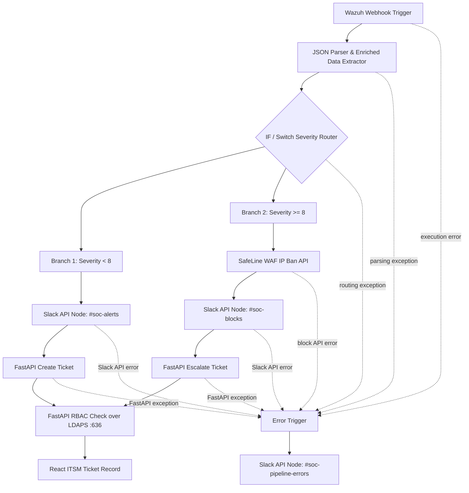

# Webhook & API Integrations

## Ingestion Endpoints
- **POST `/api/tickets`**: Accepts incident creation payloads from n8n / SIEM pipelines.
- **GET `/api/users`**: Retrieves user profile lists and role assignments.
- **GET `/api/user/rbac/{email}`**: Resolves active permissions for user identities.

## Integrations
- **Wazuh**: Automated rule alert forwarding.
- **n8n**: Workflow orchestration and payload transformation.
- **SafeLine WAF**: Web application inspection and filtering layer.

## 🔄 Automated Ingestion Workflow (n8n)

FastAPI validates the caller and applies centralized directory-backed RBAC over
encrypted LDAPS (port 636) before ticket actions are persisted or routed. Slack
credentials belong in n8n's credential store and are intentionally omitted from
the diagram and documentation.

## Slack SOAR Bot

The **SOC SOAR Bot** operates in the **SOC Lab**
workspace and routes workflow notifications to three dedicated channels:

| Channel | Events |
| --- | --- |
| `#soc-alerts` | Low/medium-confidence threat detections and Wazuh alert webhooks. |
| `#soc-blocks` | High-confidence automated firewall/WAF IP-blocking actions. |
| `#soc-pipeline-errors` | n8n execution failures and sanitized API exception traces. |

Store the Slack bot token in the n8n credential store; do not put bot tokens in
workflow exports, source files, or documentation. Error notifications must
exclude credentials and other sensitive values.

