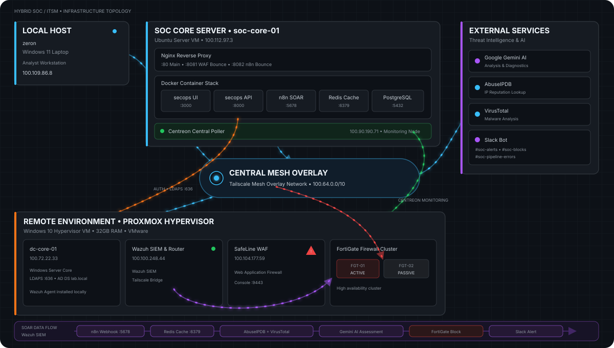
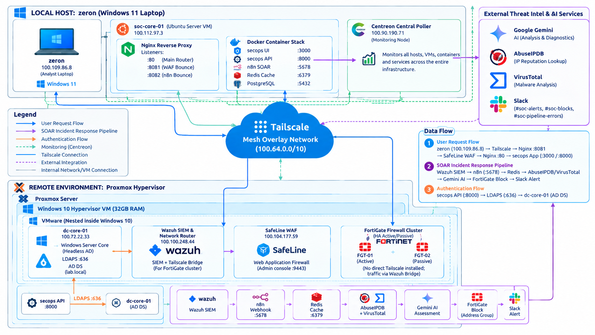

# System Architecture & Network Topology

## Component Flow
1. **Traffic Entry**: External web traffic passes through SafeLine WAF / Nginx reverse proxy.
2. **Authentication**: SOC-DC-01 runs Windows Server 2025 Core with Active Directory Domain Services. FastAPI Core authenticates directory users over encrypted LDAPS on port 636 and maps identities to RBAC roles. SafeLine WAF protects the application ingress to FastAPI.
3. **Alert Pipeline**:
   - Wazuh SIEM triggers an alert payload.
   - n8n receives the webhook and parses incoming JSON data.
   - n8n triggers the backend API (`/api/tickets`) to automatically create an incident ticket.
   - The SOC SOAR Bot routes low/medium-confidence detections and Wazuh webhooks to `#soc-alerts`, high-confidence IP blocking actions to `#soc-blocks`, and sanitized workflow/API errors to `#soc-pipeline-errors`.
   - Notifications may also dispatch via Telegram Bot API / email.

## End-to-End SOAR Alert Lifecycle

## Deployment Systems

| System | OS / Platform | Hardware / License | Components |
| --- | --- | --- | --- |
| **SOC-Core-01** | **Ubuntu 22.04 LTS** | 2 vCPU, 4 GB RAM | Docker Engine, FastAPI Core, React Frontend, PostgreSQL, Redis, n8n. |
| **SOC-Wazuh-01** | **Ubuntu 22.04 LTS** | 2 vCPU, 4 GB RAM | Wazuh Manager 4.x, Indexer, Dashboard. |
| **SOC-SafeLine-01** | **Ubuntu 22.04 LTS** | 2 vCPU, 4 GB RAM | SafeLine WAF / Reverse Proxy. |
| **SOC-DC-01** | **Windows Server 2025 Core (No GUI)** | 2 vCPU, 4 GB RAM | Active Directory Domain Services (AD DS), LDAPS (Port 636), DNS, Wazuh Agent installed locally. |
| **Network & Perimeter** | **FortiGate VM & Centreon** | Running under evaluation/free lab licenses | Perimeter firewalling and monitoring. |

There is no separate Windows client VM; the Wazuh Agent runs directly on
SOC-DC-01.

